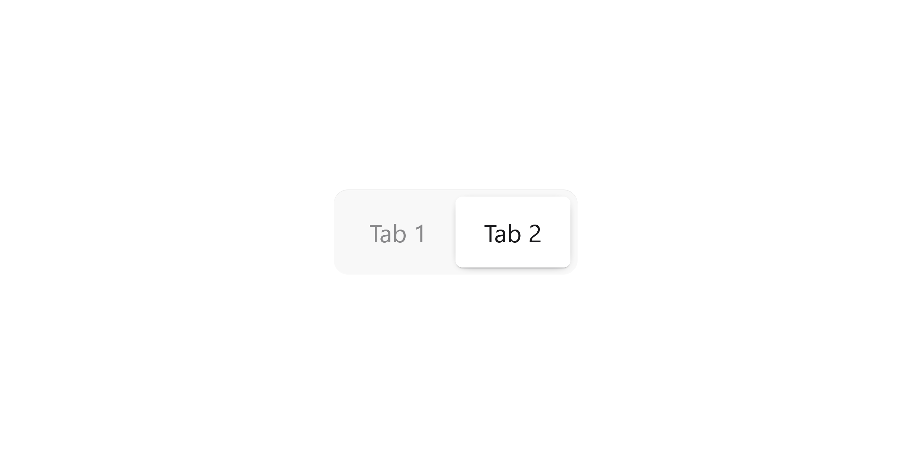

# Inconsistent bundling of tailwind and daisyui v5 with Bun 1.23

Start by running the following
```bash
bun ./src/*.html
 ```

## Expected page

Navigating to [http://localhost:3000/cdn](http://localhost:3000/cdn) will the following



## Incorrect Bundeled page

Navigating to [http://localhost:3000/bundled](http://localhost:3000/bundled) will show the following


## Exmplanation
Bundling Tailwindcss and daisyui will in the case of the tabs component not render the text inside. Comparing this to the using the cdn shows the difference.   